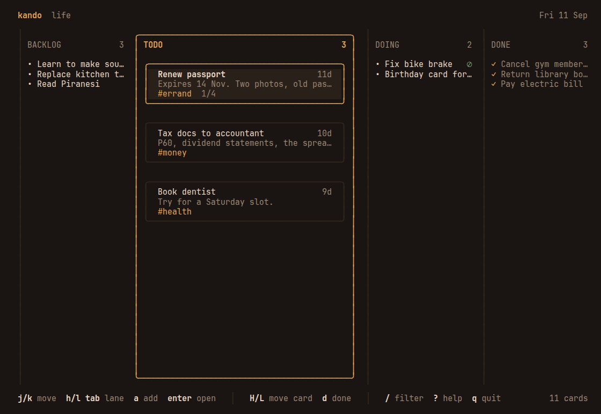
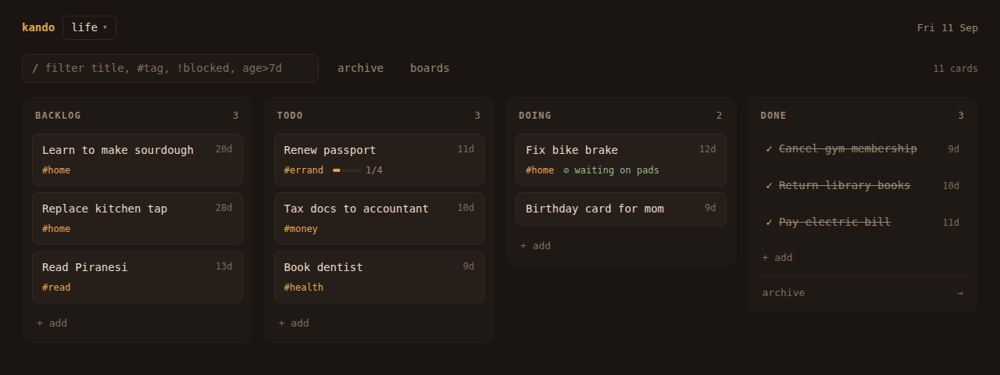
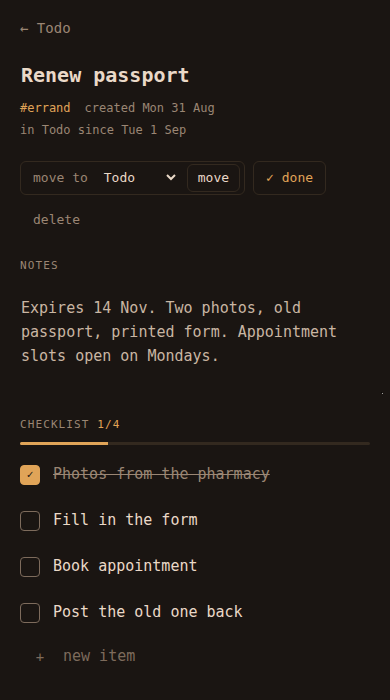

# kando

A personal kanban that replaces a notepad todo list. Cards move through four
lanes — Backlog, Todo, Doing, Done — and carry a tag, notes, a checklist and
a blocked reason. The same boards open three ways, and no capability exists
on only one of them:

- **`kando`** — a keyboard-driven terminal UI.
- **`kando web`** — a local web page that also works on a phone.
- **`kando <verb>`** — a CLI for scripts, with `--json` output.

Boards are plain Markdown files under `~/.kando`, so a text editor works too.



 

## Install

```sh
go install github.com/kaiohenricunha/kando/cmd/kando@latest
```

Needs Go 1.27 or later. From a checkout, `make build` writes the binary to
`bin/kando`.

## Quick start

```sh
kando board create life                   # boards live in ~/.kando; "life" is the default
kando add "Renew passport" --tag errand   # a new card at the top of Todo
kando                                     # open the board in the terminal; ? lists the keys
kando web                                 # the same board at http://127.0.0.1:4242/
```

## The terminal

`kando [board]` opens a board, creating it if it does not exist. The active
lane shows full cards; the other three list titles, marked `⊘` when a card is
blocked or with its checklist progress (`1/4`) when it has one. `h`/`l` change lane, `j`/`k`
select a card, `a` adds one, `enter` opens it, `H`/`L` move it and `d` sends
it to Done. `/` filters by title, `#tag`, `!blocked` or `age>7d`. Every
screen lists its own keys under `?`; they are also [below](#keys).

The minimum terminal size is 60×16 and the design target is 120×40. Below 100
columns the other lanes become a tab strip above the active one.

## The web page

`kando web [board] [--port N]` serves every board at `http://127.0.0.1:4242/`.
It binds `127.0.0.1` only and has no login, and it refuses requests from other
origins.

- **Board:** all four lanes at once. Drag a card to another lane, or to a
  place within one.
- **Card page:** the card's lane down the left and its fields on the right.
  A changed field saves when you leave it, press Enter, or press ⌘S / Ctrl+S
  in the notes. The terminal's card keys work here too: `esc`, `T` title,
  `t` tag, `e` notes, `o` new item, `m` move, `b` block, `d` done and `J`/`K`
  for the next or previous card.
- **Phone:** one lane at a time — swipe, or tap a lane tab. Move a card with
  the lane picker on its page, since dragging needs a mouse.
- **Boards list:** each board's card, Doing and blocked counts.

An open board page refreshes itself within a couple of seconds of any change,
whether it came from another tab, the terminal or your text editor. It waits
while you type or drag, so a refresh never eats your input.

## Scripts

Every verb works without opening the terminal or the browser:

```sh
kando checklist add "Renew passport" "Book an appointment"
kando checklist toggle "Renew passport" 1   # 1-based, as kando show numbers them
kando list --filter "#errand"               # the board as text
kando move "Renew passport" Done            # a card by title or id
kando list --json | jq -r '.lanes[] | select(.lane == "Done") | .cards[].title'
kando archive "Renew passport"              # a Done card into archive.md
```

Exit codes are the same for every verb: `0` done, `1` could not complete, `2`
bad arguments (nothing changed). Every verb, flag and `--json` shape is in
[docs/cli.md](docs/cli.md).

## What each surface can do

`V` means the surface has it; `X` means it does not, on purpose (see the
note).

| Capability | Web | Terminal | CLI |
|---|---|---|---|
| Open / switch to a board | V | V | V |
| Create a new board | V | V | V |
| List all boards | V | V | V |
| Quick-add a card | V | V | V |
| Show a card's full detail | V | V | V |
| Move a card between lanes | V | V | V |
| Reorder a card within a lane | V | V | X¹ |
| Delete a card | V | V | V |
| Edit title | V | V | X² |
| Edit tag | V | V | V |
| Edit notes | V | V | V |
| Block / clear block reason | V | V | V |
| Checklist: add / toggle / edit item | V | V | V |
| Filter / search (`title`, `#tag`, `!blocked`, `age>`/`<`) | V | V | V |
| List the archive | V | V | V |
| Restore a card from the archive | V | V | V |
| Archive a card (Done → archived) | V | V | V |
| Live auto-refresh on external changes | V | V | X³ |
| Help | X⁴ | V | V |

¹ Placing a card inside a lane is an interactive act: the web drags it there
and the terminal steps it with `J`/`K`. `kando move` takes a lane only, since
a headless command would have to name the neighbouring card by id.
² There is no `kando title` verb yet.
³ A CLI command runs once and exits, so there is nothing to refresh.
⁴ The web page labels its controls, and the card page lists its keys, instead
of a help screen.

## Configuration

| Variable | Effect |
|---|---|
| `KANDO_HOME` | Root directory for boards (default `~/.kando`). |
| `KANDO_THEME` | `paper` (light) or `ember` (dark). Otherwise the terminal background is detected at startup. |
| `NO_COLOR` | Drop all colours; bold, strikethrough and borders stay. |
| `KANDO_WEB_PORT` | Port for `kando web` (default 4242); `--port` overrides it. |

Each board is `$KANDO_HOME/<board>/board.md` plus `archive.md`. The format,
and what happens to hand edits, is in [docs/format.md](docs/format.md).

## Keys

Board: `j/k` select card · `h/l` `tab` `shift+tab` change lane · `H/L` move the
card to the previous/next lane (the lane follows it) · `J/K` move the card up or
down inside its lane · `a` quick add · `enter` open card · `d` move to Done ·
`u` undo (Done → Doing) · `x` delete card · `/` filter · `D` archive view · `A`
archive the card (Done only) · `B` boards · `?` help · `q` quit. Arrow keys work
everywhere `j/k/h/l` do.

Card detail: `j/k` checklist item · `x` toggle · `o` new item · `enter` edit item
· `T` title · `e` edit notes (`ctrl+s` saves, `esc` cancels) · `t` tag · `m` move
(then `1`–`4`) · `d` move to Done · `b` block reason (empty clears) · `A` archive
(Done only) · `J/K` next/previous card (when a filter hides the open card, `J`
starts from the top of the list and `K` from the bottom) · `esc` back.

Filter: type to match titles; `#tag` matches tags; `!blocked`, `age>7d`, `age<3d`
(`h` also works) are operators; tokens are AND-ed. `enter` keeps the filter,
`esc` clears it.

Archive: `j/k` move · `u` back to Doing · `enter` open · `/` filter · `esc` board.

## Development

```sh
make build      # bin/kando
make test       # go test -race -count=1 ./...
make vet
make fmt        # rewrite
make fmt-check  # verify only
```

`.local-attest.config.mjs` runs the same checks plus a `govulncheck` scan as
the local CI matrix, and `dotbabel local-attest --pr <N>` posts a SHA-pinned
attestation to the open PR. The repo has no GitHub Actions workflows, so that
attestation is the review gate.

Golden frames live in `internal/tui/testdata/`. The three `board_*.txt` files
are the reference frames: they change only with a deliberate redesign,
reviewed line by line (R-1 in
[docs/specs/kando-web/spec/8-risks-alternatives.md](docs/specs/kando-web/spec/8-risks-alternatives.md)).
The other goldens are refreshed with
`go test ./internal/tui/ -run TestGoldenScreens -update`.

Glyphs such as `…`, `✓`, `⊘`, `╌` and the arrows are East-Asian-ambiguous
width; kando counts them as one cell, which matches most terminals. A terminal
set to render ambiguous characters double-width will misalign the frame.

Design notes: [docs/design/README.md](docs/design/README.md) (terminal tokens,
copy, glyphs and keys) and [docs/specs/kando-web/](docs/specs/kando-web/) (the
web spec, including [the parity audit](docs/specs/kando-web/parity.md)).
